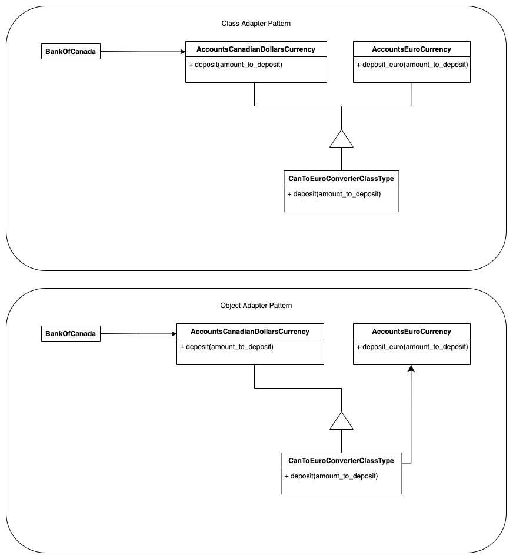

# Design Patterns in Python (with a flavor of finance)

A design pattern is a general repeatable solution to a commonly occurring problem 
in software design. A design pattern is not a finished design that can be 
transformed directly into code. It is a description or template for how to 
solve a problem that can be used in many situations.

There are several types of design patterns, including creational, structural, 
and behavioral patterns. Creational patterns deal with object creation mechanisms,
trying to create objects in a manner suitable to the situation. 
Structural patterns deal with object composition, creating relationships 
between objects to form larger structures. Behavioral patterns focus on 
communication between objects, what goes on between objects and how they
operate together.

This repository contains examples of various design patterns implemented 
in Python, with a focus on financial topics. The code in this repository 
is meant to serve as a reference for how design patterns can be implemented 
and used in real-world applications, specifically within the financial industry. 
It is not intended to be a comprehensive guide to design patterns, but 
rather a collection of examples in Python to help developers understand the 
concepts and see how they can be applied in practice in a financial context.

# Table of Contents

#### Creational

* [Abstract Factory](creational/abstract-factory/)
  ([Summary](creational/abstract-factory/README.md),
   [Generic](creational/abstract-factory/abstract_factory_generic.py), 
   [Bank account](creational/abstract-factory/abstract_factory_account.py), 
   [UI](creational/abstract-factory/abstract_factory_ui.py))

* [Builder](creational/builder/) 
  ([Summary](creational/builder/README.md),
   [Generic](creational/builder/builder_generic.py), 
   [Investment Portfolio](creational/builder/builder_portfolio.py))

#### Behavioral
* [Chain of responsibility](behavioral/cor/) 
  ([Summary](behavioral/cor/README.md),
   [Generic](behavioral/cor/cor_generic.py))

* [Strategy](behavioral/strategy/) 
  ([Summary](behavioral/strategy/README.md),
   [Generic](behavioral/strategy/strategy_generic.py), 
   [Interest Rates](behavioral/strategy/strategy_interest_rates.py))

#### Structural

* [Adapter](structural/adapter/) 
  ([Summary](structural/adapter/README.md),
   [Generic](structural/adapter/adapter_generic.py), 
   [Foreign Currency Accounts](structural/adapter/adapter_foreign_currency_account.py))

* [Bridge](structural/bridge/) 
  ([Summary](structural/bridge/README.md),
   [Generic](structural/bridge/bridge_generic.py), 
   [WIP](structural/bridge/))

### (Some of) Design patterns diagrams you'll find inside

  <table>
  <tr>
    <td colspan="2">Strategy examples</td>
  </tr>
  <tr>
    <td></td>
    <td></td>
  </tr>
  <tr>
    <td colspan="2">Abstract Factory examples</td>
  </tr>
  <tr>
    <td></td>
    <td></td>
  </tr>
  <tr>
    <td colspan="2">Adapter examples</td>
  </tr>
  <tr>
    <td></td>
    <td></td>

  </tr>
  </table>

 

# References

[1] **Design Patterns Elements of Reusable Object-Oriented Software** (by Erich Gamma, Richard Helm, Ralph Johnson, John M. Vlissides)  
[2] Python Design Patterns examples from [https://www.tutorialspoint.com](https://www.tutorialspoint.com/python_design_patterns/index.htm)

Copyright (c) 2023 vBarbaros