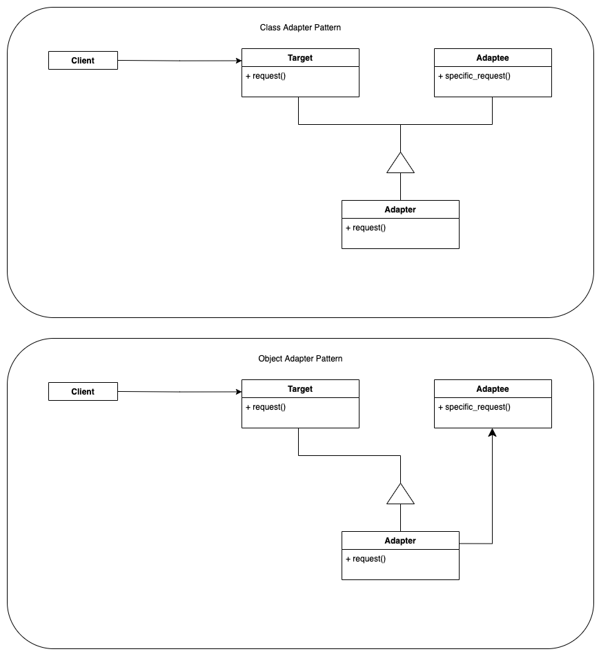

# `design-patterns-py` - Design Patterns in Python (with a flavor of finance)

This repository is intended to provide an extended collection of design patterns, 
describing briefly the main concepts and purpose. 

They are accompanied by diagrams and python examples. Wherever possible, financial 
domain knowledge and terms will be used for at least one of the examples/diagrams.

# Table of Contents
#### Behavioral
* [Strategy](behavioral/strategy/) ([Summary](behavioral/strategy/strategy-summary.md), Examples: [Generic](behavioral/strategy/strategy_generic.py), [Interest Rates](behavioral/strategy/strategy_interest_rates.py))

#### Creational
* [Abstract Factory](creational/abstract-factory/) ([Summary](creational/abstract-factory/abstract-factory-summary.md), Examples: [Generic](creational/abstract-factory/abstract_factory_generic.py), [Bank account](creational/abstract-factory/abstract_factory_account.py), [UI](creational/abstract-factory/abstract_factory_ui.py))

#### Structural
* [Adapter](structural/adapter/) ([Summary](structural/adapter/adapter-summary.md), Examples: [Generic](structural/adapter/adapter_generic.py), [WIP](structural/adapter/..)))

### Design patterns diagrams you'll find inside

  <table>
  <tr>
    <td></td>
    <td></td>
  </tr>
  <tr>
    <td></td>
    <td></td>
  </tr>
  <tr>
    <td></td>

  </tr>
  </table>

# References
[1] **Design Patterns Elements of Reusable Object-Oriented Software** (by Erich Gamma, Richard Helm, Ralph Johnson, John M. Vlissides)  
[2] Python Design Patterns examples from [https://www.tutorialspoint.com](https://www.tutorialspoint.com/python_design_patterns/index.htm)

Copyright (c) 2022 vBarbaros