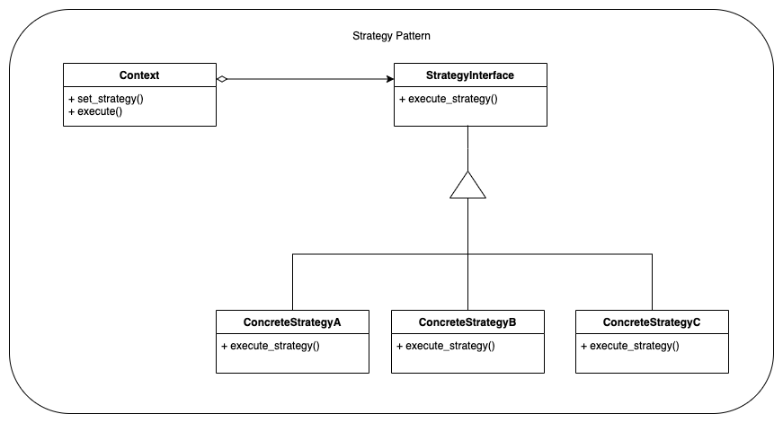
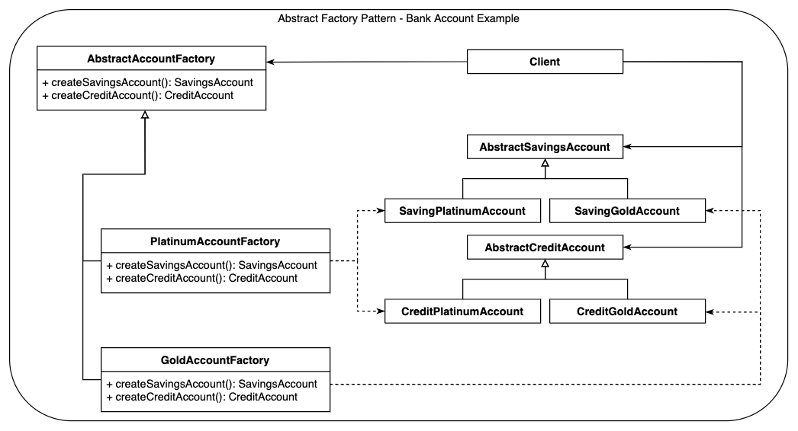

# Design Patterns in Python (with a flavor of finance)

This repository aims to provide an extended collection of OOP Design Patterns, 
briefly describing the main concepts and purpose for each of them, all this in 
the context of financial domain knowledge.

# Table of Contents

#### Creational

* [Abstract Factory](creational/abstract-factory/)
  ([Summary](creational/abstract-factory/README.md),
   [Generic](creational/abstract-factory/abstract_factory_generic.py), 
   [Bank account](creational/abstract-factory/abstract_factory_account.py), 
   [UI](creational/abstract-factory/abstract_factory_ui.py))

* [Builder](creational/builder/) 
  ([Summary](creational/builder/README.md),
   [Generic](creational/builder/builder_generic.py), 
   [Investment Portfolio](creational/builder/builder_portfolio.py))

#### Behavioral

* [Strategy](behavioral/strategy/) 
  ([Summary](behavioral/strategy/README.md),
   [Generic](behavioral/strategy/strategy_generic.py), 
   [Interest Rates](behavioral/strategy/strategy_interest_rates.py))

#### Structural

* [Adapter](structural/adapter/) 
  ([Summary](structural/adapter/README.md),
   [Generic](structural/adapter/adapter_generic.py), 
   [Foreign Currency Accounts](structural/adapter/adapter_foreign_currency_account.py))

* [Bridge](structural/bridge/) 
  ([Summary](structural/bridge/README.md),
   [Generic](structural/bridge/bridge_generic.py), 
   [WIP](structural/bridge/))

### (Some of) Design patterns diagrams you'll find inside

  <table>
  <tr>
    <td colspan="2">Strategy examples</td>
  </tr>
  <tr>
    <td></td>
    <td></td>
  </tr>
  <tr>
    <td colspan="2">Abstract Factory examples</td>
  </tr>
  <tr>
    <td></td>
    <td></td>
  </tr>
  <tr>
    <td colspan="2">Adapter examples</td>
  </tr>
  <tr>
    <td></td>
    <td></td>

  </tr>
  </table>

 

# References

[1] **Design Patterns Elements of Reusable Object-Oriented Software** (by Erich Gamma, Richard Helm, Ralph Johnson, John M. Vlissides)  
[2] Python Design Patterns examples from [https://www.tutorialspoint.com](https://www.tutorialspoint.com/python_design_patterns/index.htm)

Copyright (c) 2022 vBarbaros