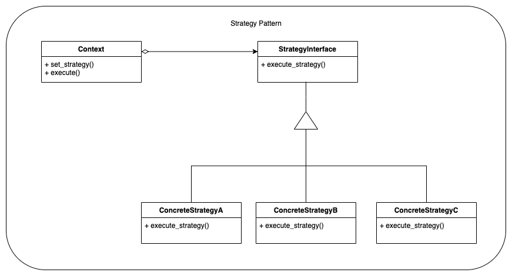
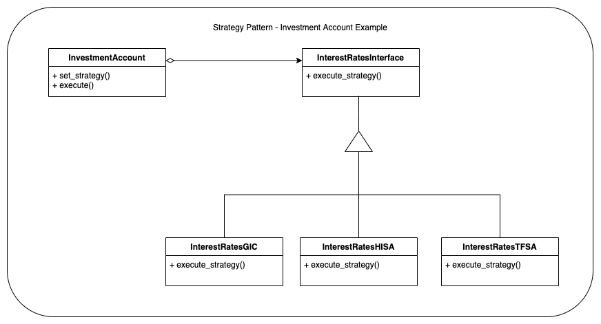

# Main idea
When we need to define multiple algorithms, it's easier to encapsulate each of them
and make them interchangeable for a certain client/scope in which they are used.
The strategy makes it very flexible to be used depending on the clients that try to.

# Also known as
* Policy

# Why you need it
Given a set of Clients C and a set of Algorithms A, we can have the following situations:
* Clients in C supporting multiple algorithms from A, may become too complex and hard to maintain;
* Many algorithms from A may be needed at different times, and we want to support only those need at certain times;
* It would be difficult to add new Algorithms in A, and/or modify the existing ones if we let them become embedded with clients;

We can avoid these issues by encapsulating each algorithm into separate classes. An algorithm that
is encapsulated in this way, is called a strategy.

# When to use
* When you have many related classes that are different in some parts of their behavior;
* When you want to make use of multiple variations of the same algorithm;
* When you have algorithms using data that the client should not be aware of;
* When you end up with a class having multiple variations, defined in separate conditional statements;

## Generic Example
### Class Diagram

### Link to [source-code for strategy - generic example](strategy_generic.py)

## Investment Strategy Example
### Class Diagram

### Link to [source-code for strategy - interest_rates example](strategy_interest_rates.py)

#### Link to [Main README](../../README.md)