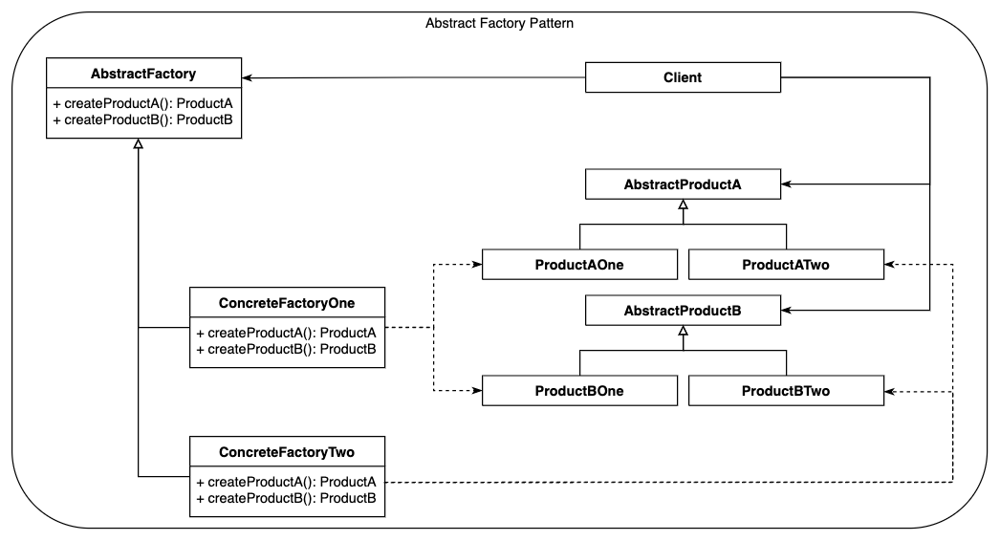
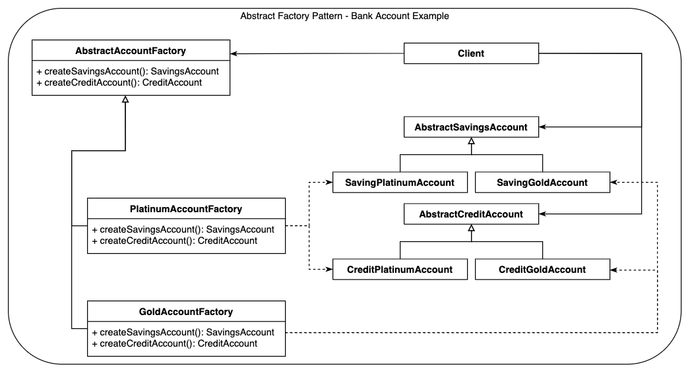

# Intent
To (1) provide an interface that can be used for (2) creating families of related or 
dependent objects (3) with no need to specify their concrete classes.

# Also known as
Kit [1], Factory of Factories [2]

# Motivation

# Bibliography:
1. **Design Patterns Elements of Reusable Object-Oriented Software** (by Erich Gamma, Richard Helm, Ralph Johnson, John M. Vlissides)
2. [Abstract Factory on https://www.tutorialspoint.com](https://www.tutorialspoint.com/python_design_patterns/python_design_patterns_abstract_factory.htm)