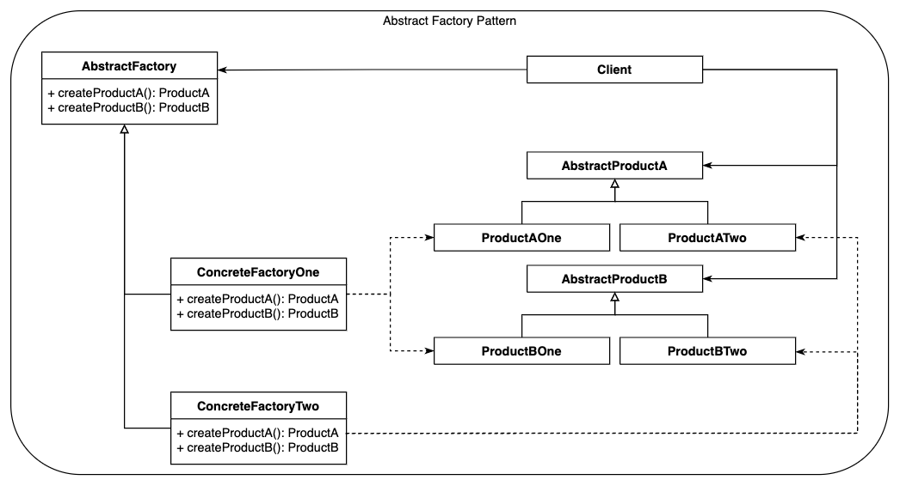
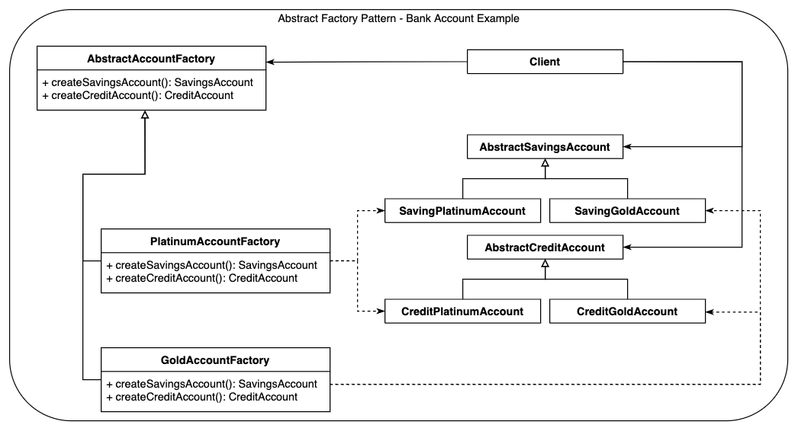
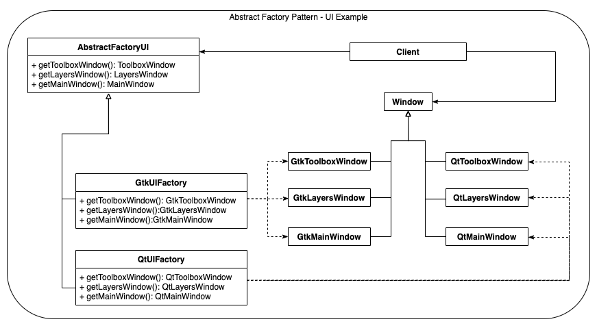

# Main idea
To (1) provide an interface that can be used for (2) creating families of related or 
dependent objects (3) with no need to specify their concrete classes.

# Also known as
* Kit
* Factory of Factories

# Why we need it
A good example given in [1] is the need to provide a User Interface with different 
Look-And-Feel setups across different platforms. In that case you define a UI Abstract Factory
which is inherited by separate Concrete Factories which internally put together the needed
Look-And-Feel components, according to their roles.

## Generic Example
### Class Diagram
The generic class diagram for the Abstract Factory pattern can be seen below:

### Link to [source-code for generic example](abstract_factory_generic.py)

## Bank Accounts Example
### Class Diagram
Another example used in this documentation defines a use-case for a Bank UI Client
which provides an Abstract Factory that creates the Look-And-Feel for the set of
Savings and Credit Accounts, depending on whether it's a Platinum or Gold Account Type.

### Link to [source-code for generic example](abstract_factory_account.py)

## UI Example (adapted from [2])
### Class Diagram
A third example we use defines a use-case for a Windows creation client that provides 
an Abstract UI Factory. This UI Factory can create Window objects by using either the GtK or Qt framework.

### Link to [source-code for generic example](abstract_factory_ui.py)

#### Link to [Main README](../../README.md)