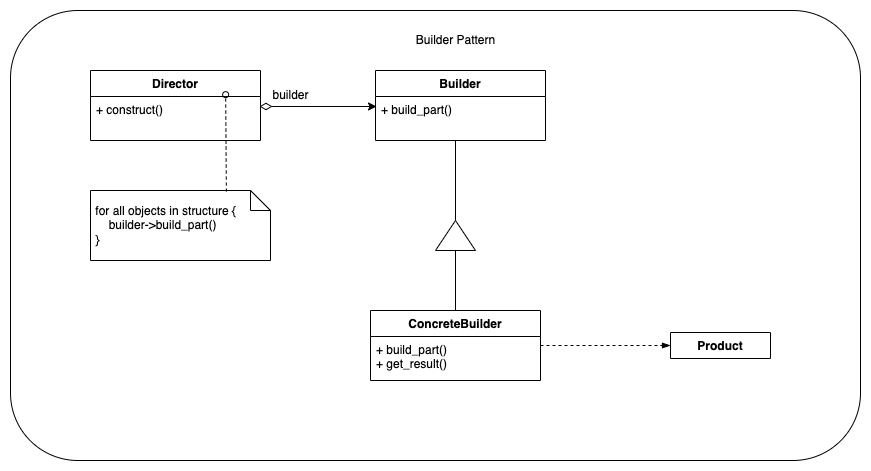
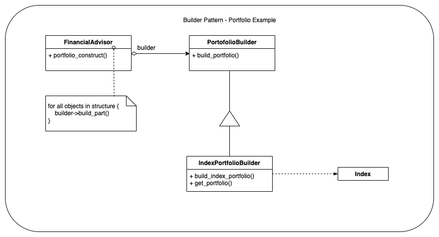

# Main idea
Separate the construction of a complex object from its representation 
so that the same construction process can create different representations.

# Also known as
N/A

# Why we need it
When a specific functionality is provided by a considerably complex class
you would prefer to have a template of such a class so that for variations
of the aforementioned functionality it is easy add new classes of similar
complexity.

## Generic Example
The generic class diagram for the Builder pattern can (or will) be seen below:
### Class Diagram

### Link to [source-code for builder - generic example](builder_generic.py)

## Financial Portfolio Example
### Class Diagram

### Link to [source-code for builder - TBD example](*.py)

#### Link to [Main README](../../README.md)