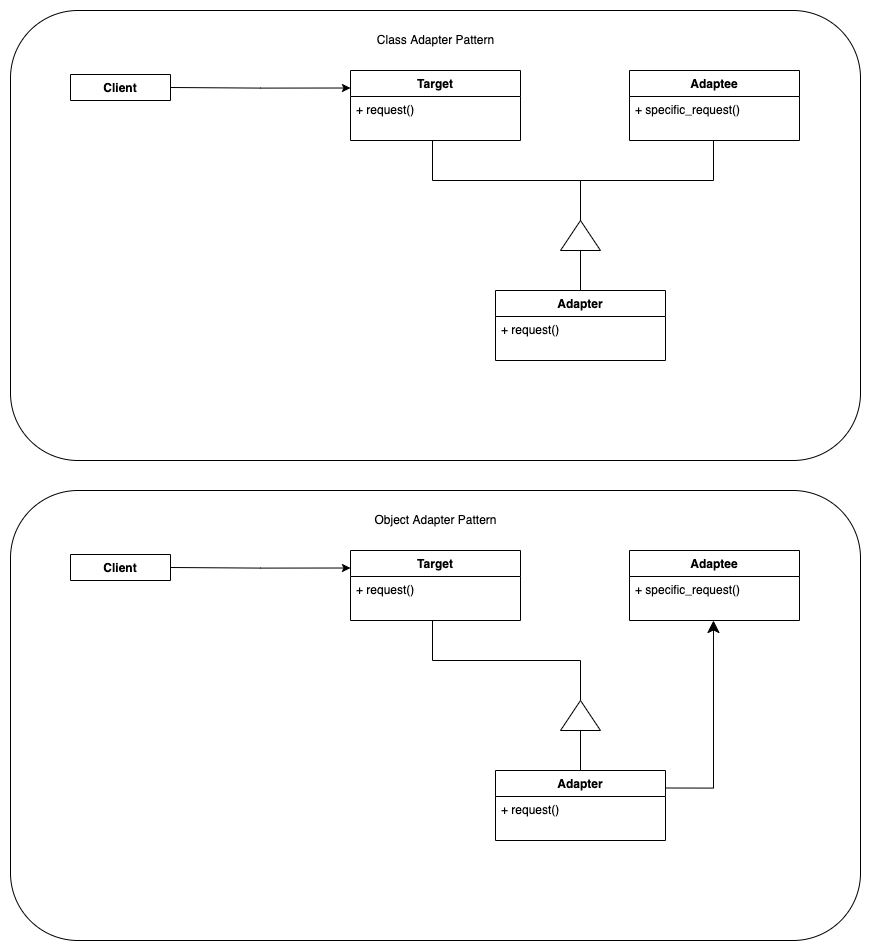
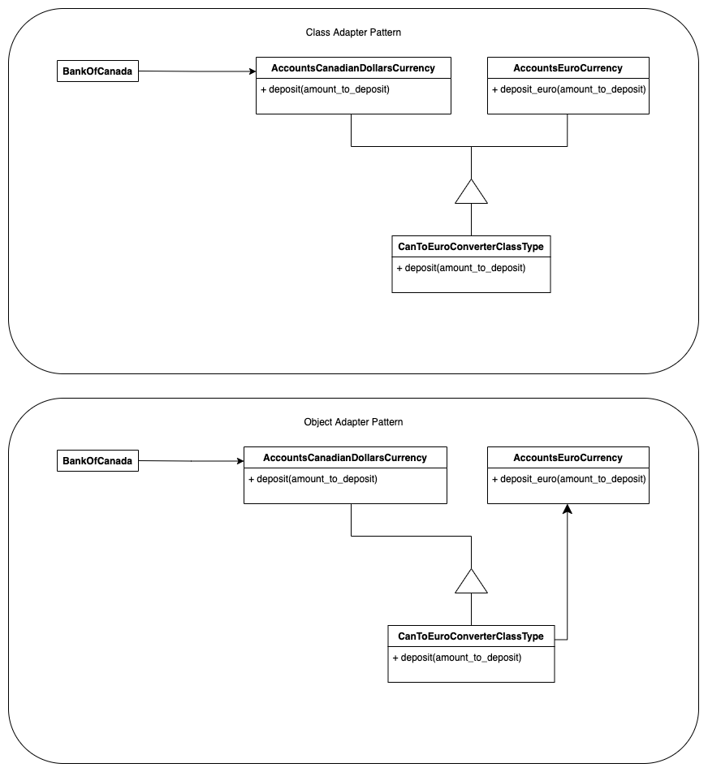

# Main idea
Makes it possible for classes with incompatible interfaces to still work together.

# Also known as
* Wrapper

# Why you need it
You will need this pattern when you want to use an interface from another application
that does not directly map to your domain-knowledge application.

## Generic Example
### Class Diagrams (Class & Object Adapter Pattern diagrams)

### Link to [source-code for adapter - generic example](adapter_generic.py)

## Foreign Currency Account Example
### Class Diagrams (Class & Object Adapter Pattern diagrams)

### Link to [source-code for adapter - foreign currency account example](adapter_foreign_currency_account.py)

[>> back-to-structural](../README.md)

[>> back-to-main](../../README.md)