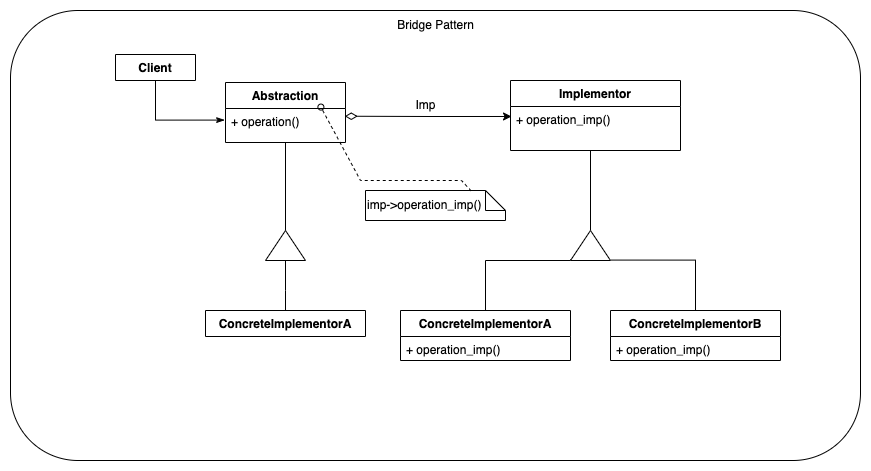

# Main idea
We want to decouple an abstract entity from its implementation so that
each of the two can vary independently.

# Also known as
Handle, Body

# Why you need it
You may have an entity you want to define an interface for. This
entity, when used will be implemented by each Implementation Classes.
Assume that this entity has variations A, B and C of the same property, 
thus ou will end up with three separate implementations:
* ImplPropertyA, 
* ImplPropertyB, and 
* ImplPropertyC.

Now, consider that we can use these properties, A, B and C, in two different 
ways - alpha and beta. If we want to display the second dimension of our original entity,
we will need to have implementations for each of the possible combinations
of Properties (A, B, C) and Methods of usage (alpha, beta). We will have the following
implementations:
* ImplPropertyAMethodAlpha
* ImplPropertyBMethodAlpha
* ImplPropertyCMethodAlpha
* ImplPropertyAMethodBeta
* ImplPropertyAMethodBeta
* ImplPropertyAMethodBeta

A better options is to have two hierarchical systems, in which one will be
responsible for the properties, while the other will be providing the methods.
The Bridge pattern will use the object composition to put all the combinations together
depending on client's needs.

## Generic Example
### Class Diagram

### Link to 

## <Name 1> Example
### Class Diagram

### Link to 

## <Name 2> Example
### Class Diagram

### Link to 

[>> back-to-structural](../README.md)

[>> back-to-main](../../README.md)